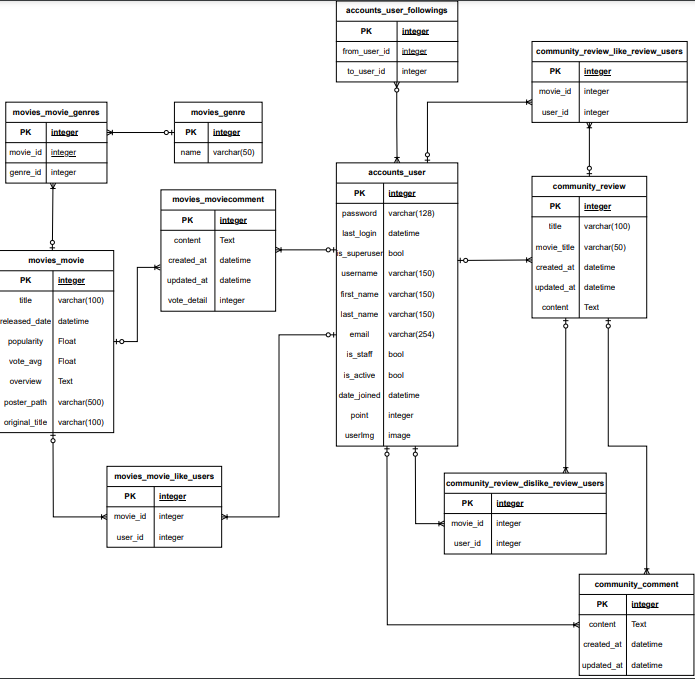
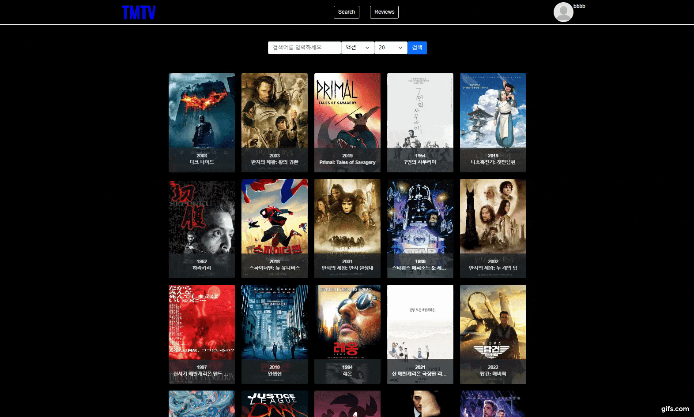
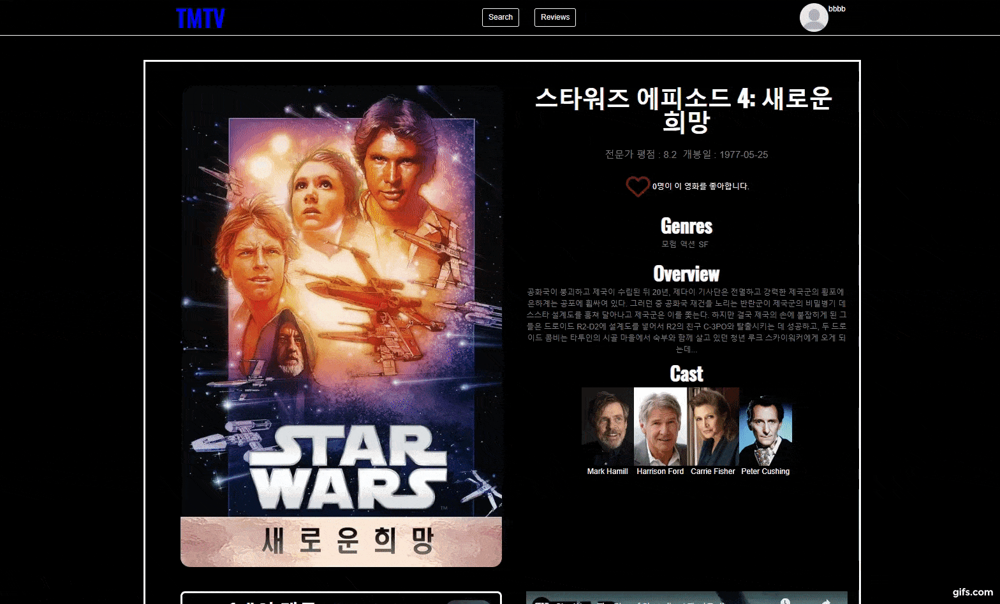
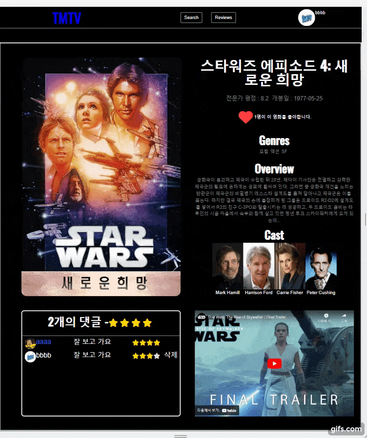
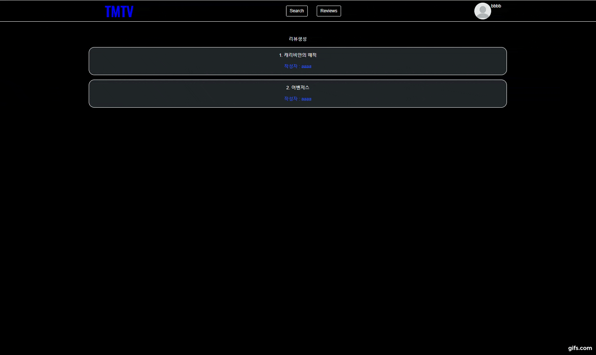
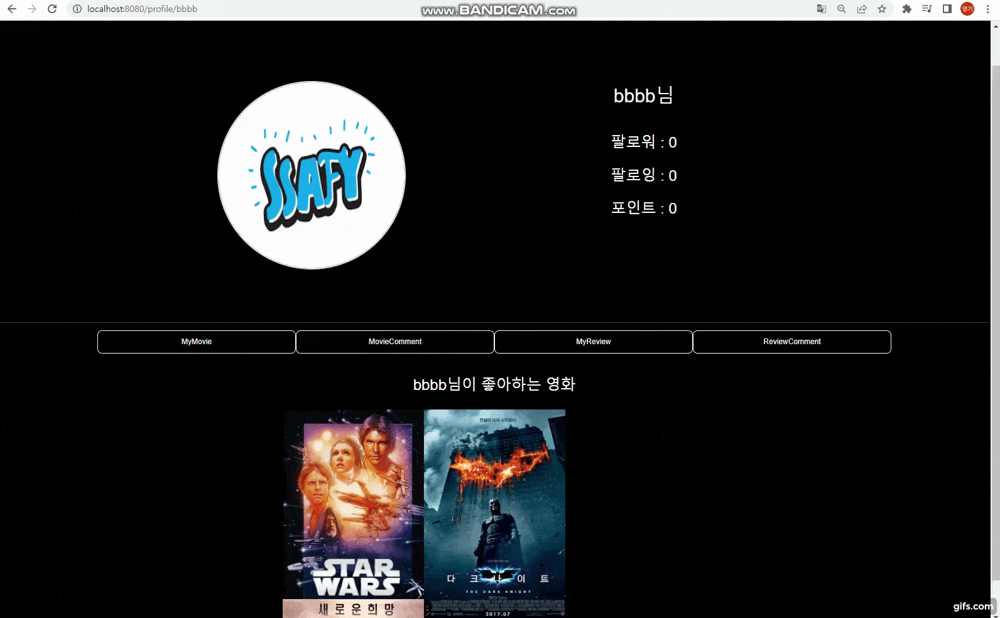

# 영화 추천 사이트 프로젝트

### Description

---

```textile
페이지를 이동하지 않고 간단하게 영화 정보를 수집.
가볍게 보고 영화를 추천받을 수 있는 영화 정보 커뮤니티.
```

### 1. 팀원 정보 및 업무 분담 내역

- 안영기 : front-end
  
  - 기술 스택
    
    - Vue.js
    
    - Vuex, Vue-router
    
    - HTML, CSS, JavaScript

- 우주연 : back-end, front-end 일부
  
  - 기술 스택
    
    - Django
    - DRF
    - Python

### 2. 목표 서비스 구현 및 실제 구현

|     | 기능                | 설명                                                |
| --- | ----------------- | ------------------------------------------------- |
| 1   | 로그인/로그아웃          | 토큰을 통한 유저 회원가입 및 로그인 기능                           |
| 2   | 로그아웃              | 로컬스토리지에 저장한 토큰 삭제                                 |
| 3   | tmdb api          | api를 이용해 tmdb 영화와 장르 DB화                          |
| 4   | 영화 메인 페이지         | 추출한 데이터를 이용하여 영화 데이터 출력 및 css 마우스 호버 기능           |
| 5   | 영화 디테일 페이지        | 영화 데이터를 이용해 유튜브 api에 연결, 반응형 css를 이용한 뷰 출력창 변화 기능 |
| 6   | 영화 리뷰             | 사용자 댓글, 평점 출력 및 종합 기능                             |
| 7   | 커뮤니티 페이지          | 글 CRUD 기능 구현                                      |
| 8   | 커뮤니티 디테일 페이지      | 댓글, 추천, 비추천 기능을 통한 사용자 블랙리스트, 화이트리스트 생성 기능        |
| 9   | 프로필               | 유저 간 팔로우, 팔로잉 기능 구현                               |
| 10  | 프로필 컨텐츠           | 사용자의 컨텐츠 모아보기 기능                                  |
| 11  | 영화 추천 페이지         | Carousel을 이용하여 추천 영화 보기                           |
| 12  | 영화 추천 알고리즘        | 사용자 기반, 항목기반 필터링                                  |
| 13  | 안내창               | 비로그인 상태로 접근시 alert창 으로 안내                         |
| 14  | 404 페이지 기능        | 유효하지 않은 url 접근시 404 페이지로 이동                       |
| 15  | 없는 영화, 리뷰, 프로필 제한 | 유효하지만 없는 url 접근시 404 페이지로 이동                      |

### 3. 데이터베이스 모델링(ERD)



### 4. 영화 추천 알고리즘에 대한 기술

- 사용자 기반 협업 필터링
  
  - **특정 사용자와 유사한 취향을 가진 다른 사용자를 찾아 해당 사용자가 좋아하는 영화를 추천합니다.**
    
    - 특정 사용자가 좋아하는 영화를 좋아하는 다른 유저들의 좋아요한 영화를 특정사용자가 좋아요한 영화를 제외해서 추천영화로 가져옵니다.
    
    - 만약 특정 사용자가 좋아하는 영화를 좋아하는 다른 유저들이 없거나 다른유저들의 좋아요한 영화가 적을경우를 대비해 좋아요한 영화의 장르와 같은 장르의 영화들을 추천영화로 가져옵니다.
    
    - 추천영화는 좋아요를 받은 수가 높은 순서대로 정렬됩니다.

- 항목 기반 협업 필터링(줄거리)
  
  - **영화의 특정 항목과 유사한 특성을 가진 다른 항목을 찾아 해당 항목을 추천합니다.**
  
  - **이를 위해 영화들 줄거리 간의 코사인 유사도(cosine similarity)를 계산하고, 유사도가 높은 영화들을 사용자에게 추천합니다.**
    
    - 특정 사용자가 좋아하는 영화를 가져온후 그 영화를 제외한 모든 영화도 가져옵니다.
    
    - 좋아하는 영화 각각과 나머지 모든 영화들의 줄거리 텍스트를 scikit-learn 라이브러리를 이용해 벡터화 합니다.
    
    - 좋아하는 영화 각각에 대해 나머지 모든영화들의 줄거리들의 코사인유사도를 계산합니다.
    
    - 유사도가 높은순으로 정렬하여 추천영화를 사용자에게 추천합니다.

### 5. 서비스 대표 기능에 대한 설명

- 내 관심 영화에 기반한 영화추천 기능

- 커뮤니티 내 추천, 비추천 기능을 이용한 블랙리스트, 화이트리스트 기능

### 6. 기타(느낀 점)

- 안영기
  
  - 싸피에 적응하고 조금 느슨하게 풀리던 시기에 마음을 다잡고 열심히 달리게 했던 시간이었습니다.
    
    한학기 동안 배운 것을 종합하고, 새로운 툴을 찾아보고, 적용하며 많은 많은 것을 배울 수 있었습니다.
    
    문제에 부딪히면서 기획의 중요성에 대해 깨닫게 되었고 더 발전할 요소가 보여 아쉬움이 남지만, 에러들을 하나하나 해결해 나가면서 새로운 방법을 찾아내고, 배웠던 것들을 내 것으로 만들면서 빠르게 성장하는 기회가 되었습니다.

- 우주연
  
  - 각자의 분야에 대한 역할을 정하고 협력하여 프로젝트를 진행하면서 많은것을 배울수 있었습니다. 백엔드와 프론트엔드간의 상호작용이 필요함을 느꼈고 팀원과 함께 전체적인 시스템을 이해하고 개발하는과정에서 서로의 역할분야에 대한 이해도를 높일수가 있었습니다.
    
    특히 주로 백엔드를 맡으면서 내가 보낸 데이터가 프론트에서 어떻게 쓰일지, 또는 어떻게 가공,구현해서 보내야 효율적으로 사용할지에 대한 고민을 하고 소통을 하면서 많은 것을 느낄수 있었습니다.
    
    다음에 프로젝트를 한다면 위의 경험을 살려서 더욱더 좋은 결과를 내고 싶습니다.

# TMTV

### Getting Started

---

- backend 폴더에서
  - `python -m venv venv`
  - `source venv/Scripts/activate`
  - `pip install requirements`

- 최초 실행할 경우 꼭 수행
  - 데이터베이스 생성
    - `python manage.py migrate`
  - json 데이터를 DB에 dump
    - `python manage.py loaddata genre_data.json movie_data.json`
- `python manage.py runserver`

- frontend 폴더에서
  - `npm i`
  - `npm run serve`

### Overview

---

#### Main



메인페이지는 마우스의 위치에 따라 영화에 대한 더 자세한 정보를 볼 수 있습니다.

검색 기능과 장르 필터를 통해 세분화 하여 볼 수 있고, 한번에 출력되는 영화의 개수를 조절할 수 있습니다.

#### Detail-1



#### Detail-2



영화포스터와 기본 정보들을 불러오고, 사용자 댓글과 평점을 보여줍니다. youtube API를 사용하여 해당영화의 트레일러 영상을 불러옵니다.

영화 디테일 페이지는 반응형 css를 사용했습니다. 화면의 크기에 따라 크기가 조정되고 창이 작아진다면 그에 맞게 세로로 내용이 배치됩니다.

#### Recommand


영화 추천 페이지는 vue carousel을 이용해 만들었습니다.

같은 영화를 좋아한 유저의 데이터를 사용하는 사용자 기반 필터링과, 관심 영화의 데이터를 추출하여 유사도를 비교해 비슷한 영화를 추천하는 항목 기반 필터링을 사용했습니다.

#### Community



커뮤니티에는 추천, 비추천 기능이 있습니다. 추천, 비추천에 따라 추천을 받은 사용자에게 일정 포인트가 부여되고, 일정 점수가 되면 유저의 이름에 색상이 부여됩니다. 비추천을 많이 받아 이름이 붉게 변하면 리뷰 글, 댓글 등에 제한이 생깁니다.

#### Profile



프로필 페이지에서는 프로필 사진을 등록할 수 있고, 사용자가 이용한 컨텐츠를 모아볼 수 있습니다.
